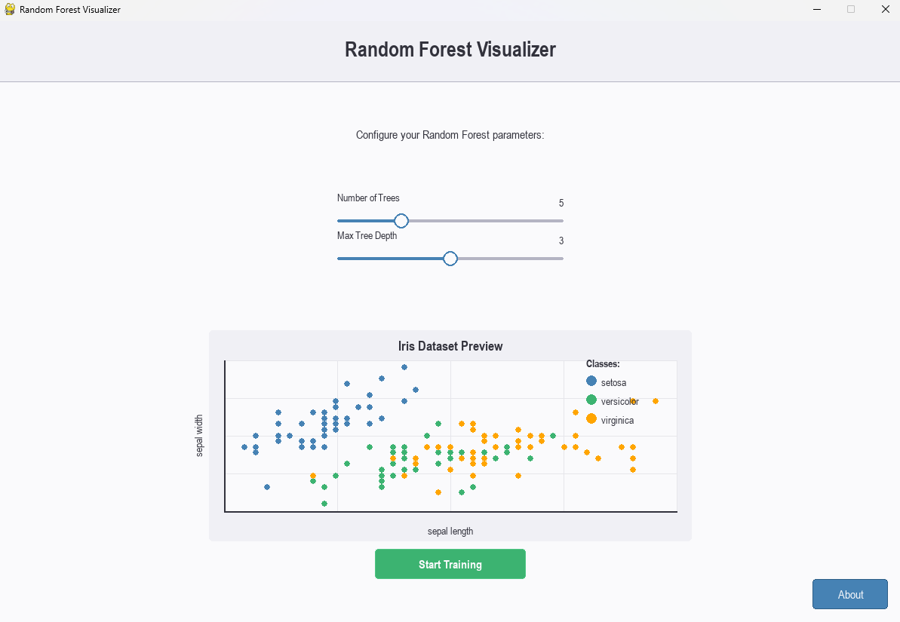
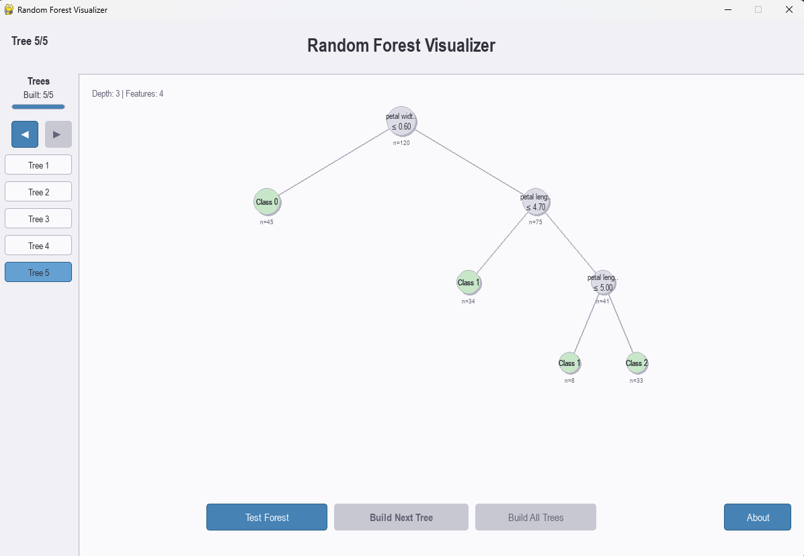

# Random Forest Visualizer

An interactive educational tool for visualizing Random Forest algorithms, from training to prediction.

## Overview

The Random Forest Visualizer is a Python application that provides an intuitive and interactive way to understand how Random Forests work. It allows users to:

- Configure forest parameters (number of trees, max depth)
- Visualize the decision trees being built step-by-step
- See how trees vote to make final predictions
- Explore decision paths through individual trees
- Test the model on sample data and see accuracy metrics


*Setup screen where users can configure forest parameters*


*Interactive visualization of a decision tree with prediction path*

## Features

- **Interactive Training**: Build trees one by one or all at once
- **Tree Exploration**: Navigate between different trees in the forest
- **Decision Path Animation**: See how new samples traverse through the decision trees
- **Voting Visualization**: Understand how trees vote to make the final prediction
- **Performance Metrics**: View accuracy and per-sample predictions

## Installation

1. Clone this repository:
```bash
git clone https://github.com/bishallamichhane44/random_forest-visualizer.git
cd random_forest-visualizer
virtualenv venv
./venv/Scripts/activate
pip install -r requirements.txt
python main.py
```
